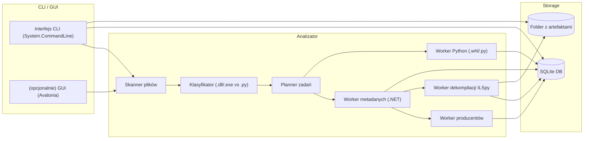
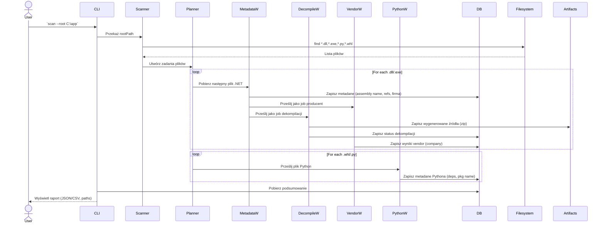
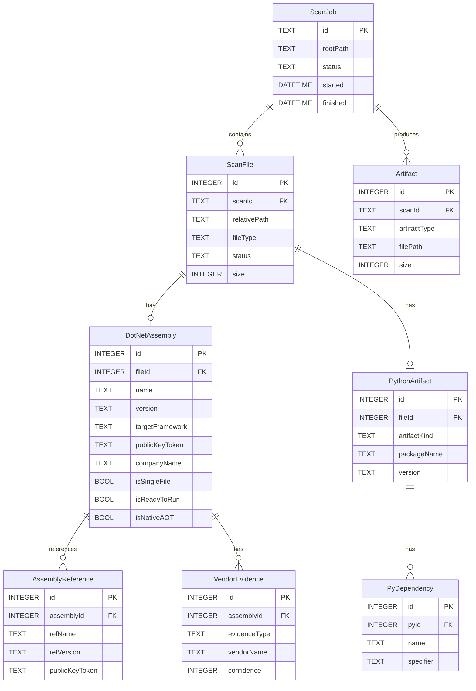

# Raport analityczny projektu dekompilacji i analizy aplikacji .NET

## Streszczenie

Zaproponowany projekt to **lekkie, lokalne narzędzie** do analizy binariów .NET (opcjonalnie Python), zbudowane na otwartoźródłowych komponentach. Kluczowymi celami są: *pełna dekompilacja* IL‑owych assembly (generowanie projektu źródłowego), *identyfikacja producentów* bibliotek (atrybuty, metadane, podpisy) oraz *mapowanie stacku technologicznego* (lista zależności i target framework). Analiza ma działać w trybie offline na wskazanym katalogu (ścieżka „root” – brak określenia z góry, musi być podana przez użytkownika) i obsługiwać pliki .NET (`.dll`, `.exe`) oraz opcjonalnie pliki Python (`.py`, `.whl`). 

Rekomendowane narzędzia to przede wszystkim **ILSpy** (OSS na licencji MIT【1†L471-L475】) jako domyślny dekompilator, wspomagany silnikiem **ICSharpCode.Decompiler** (również MIT) do osadzania w aplikacji. Dla analizy metadanych użyjemy bibliotek **Mono.Cecil** (MIT【8†L360-L364】), **dnlib** (MIT【11†L13-L16】) lub **AsmResolver** (MIT【14†L287-L291】), a dla PE zasobów np. **pefile** (MIT【5†L270-L278】) lub **LIEF** (Apache-2.0【19†L341-L344】). Weryfikację podpisów Authenticode umożliwi **Signify** (Python). 

Architektura aplikacji zakłada prosty **interfejs CLI** (.NET System.CommandLine), opcjonalnie skromny GUI (np. Avalonia WPF), in-memory queue (Channels) dla kolejkowania zadań i SQLite jako lokalny magazyn wyników. Wyniki zapisywane będą w JSON/CSV, a także w SQLite (`jsonb`-podobnych strukturach). Zapewniamy sandboxing poprzez brak wykonywania obcych binariów – analizujemy je pasywnie. Legalność dekompilacji oparta jest na przepisach prawa UE i polskiego (deklarowana dozwolona interoperacyjność i poprawki błędów)【27†L91-L97】. Kluczowe ADR obejmują wybór ILSpy jako podstawowego dekompilatora, SQLite jako lokalnego DB oraz retry w pamięci. Poniższe tabele i diagramy ilustrują wybrane technologie, przepływy i strukturę danych; dokument zawiera też przykładowe skrypty i polecenia (bash/Python oraz ILSpyCLI). Raport datowany jest na 2026-05-15.

## Cele, wymagania wejściowe i zakres

Projekt ma umożliwić **przeprowadzenie kompleksowej analizy wskazanego katalogu** z aplikacjami .NET (główne priorytety) i opcjonalnie z plikami Python. Wymagania wejściowe:
- **Ścieżka katalogu** (`rootPath`) – **nieokreślona** z góry (użytkownik musi ją podać); brak wartości spowoduje błąd walidacji.
- **Zakres plików:** typowo `.dll` i `.exe` zawierające kod .NET (CLR) – pełna dekompilacja w ILSpy. Opcjonalnie pliki Python: surowe `.py` (przeczytamy AST) i archiwa `.whl` (zip z metadanymi projektu). 
- **Priorytety:** dekompilacja .NET w pierwszym planie, Python jako dodatkowy tor.

**Cele operacyjne:** 

- *Pełna dekompilacja IL:* dla assembly IL (kod pośredni) narzędzie powinno wygenerować źródła C# w formie projektu (np. używając `ilspycmd -p -o <dir> <assembly>`, wspierającego generowanie PDB)【1†L471-L475】. Trzeba przyznać, że architektury *single-file bundle* i *ReadyToRun* z .NET mogą wymagać dodatkowych kroków rozpakowania lub specyficznych technik, a *Native AOT* (kompilacja do natywnego pliku) z ograniczonym IL jest de facto częściowo dostępna jedynie do analizy symboli. 
- *Identyfikacja producentów:* oznacza gromadzenie metadanych takich jak `AssemblyCompany`, `FileVersionInfo.CompanyName`, `ProductName` itp. oraz sprawdzenie podpisów Authenticode certyfikatami (np. przy pomocy Signify) lub zewnętrznych baz NuGet. Wielowarstwowy model zaufania: najwyższe znaczenie ma oficjalny podpis (Authenticode), następnie metadane NuGet (`.nuspec`) lub wheel metadata, a w razie braku – informacje w assembly. 
- *Mapowanie stacku technologicznego:* zdobywanie listy zewnętrznych zależności i celowanego frameworka. Źródła: `TargetFrameworkAttribute` (TVM target), plik `<app>.deps.json`/`runtimeconfig.json` (runtime .NET), manifesty `.nuspec`/`packages.config`/`packages.lock.json` (zależności NuGet), a nawet ścieżka do SDK. Dla Pythona: `pyproject.toml`, `METADATA` i importy z AST. 
- *Wyjścia raportu:* główne jako JSON i CSV (tabele), opcjonalnie eksport SBOM w formacie CycloneDX JSON (jeśli mamy źródła projektu) – wszystkie na dysku lokalnym.

## Narzędzia OSS do dekompilacji i analizy .NET

Wybieramy projekty **aktywne** z GitHub w latach 2024–2026, o licencjach OSS. Kluczowa różnica między narzędziami to forma: **wiadomości command-line** versus **biblioteki embedowalne**.

| Narzędzie / Biblioteka | Zastosowanie | Licencja | Repo (gwiazdki, ostatni commit) | Uwagi |
|---|---|---|---|---|
| **ILSpy (icsharpcode/ILSpy)** | GUI i CLI dekompilator (polecenie `ilspycmd`) | MIT【1†L471-L475】 | ~8k ★ (proj. wiodący), ostatni commit 2026 | Najpopularniejszy OSS dekompilator .NET. Zapewnia generowanie projektów, PDB, obsługę R2R i single-file. |
| **ICSharpCode.Decompiler (NuGet)** | Silnik dekompilacji ILSpy jako biblioteka | MIT【1†L471-L475】 | (część ILSpy) | Używany do osadzania dekompilacji w aplikacji; np. można załadować plik i wywołać API dekompilatora. |
| **dnSpyEx** | Desktop .NET debugger+dekompilator (GUI) | GPL-3.0 (unofficial fork) | ~5.5k ★, ostatni commit 2024 | Rozbudowany edytor + debugger; użyteczny do ręcznej analizy, nie tryb „batch”. GPL utrudnia integrację w innym kodzie. |
| **CodemerxDecompile** | Wieloplatformowy dekompilator standalone | AGPL-3.0【3†L293-L300】 | 383 ★, ostatni release 1.5.0 (2024) | Oparty na JustDecompile. Wysoka licencja (AGPL). GUI bazujący na Avalonia od wersji >1.0. |
| **dotPeek** | Decompiler JetBrains (dla info) | Proprietary, darmowy | – | Nie wolne źródła, tylko wzmianka. Z tego powodu nie zalecamy do integracji. |

*Uwaga:* W tabeli powyżej „gwiazdki” są orientacyjne (z GitHub). **ILSpy** jest kanoniczną wolną alternatywą dla dotPeek【1†L471-L475】. **CodemerxDecompile** to ciekawa multiplatforma, ale AGPL może być ograniczeniem. **dnSpyEx** – mistrz ręcznej analizy (w tym edycji IL/metadata), ale trudno go użyć jako komponentu w pipelinie (ze względu na GPL i GUI).

## Narzędzia do analizy metadanych, PE i weryfikacji producenta

Po pierwszej pasywnej fazie analizy każdy plik można przejrzeć za pomocą bibliotek do PE i .NET. Poniżej porównanie kilku lekkich, otwartoźródłowych komponentów:

| Biblioteka/Narzędzie | Rola w projekcie | Licencja | Repo (gwiazdki) | Uwagi |
|---|---|---|---|---|
| **System.Reflection.Metadata + PEReader (.NET API)** | Niskopoziomowy dostęp do struktur .NET i PE | Microsoft (część .NET) | – (MS API) | Szybki, nie wymaga ładowania Assembly. Pozwala czytać nagłówek PE i meta. Bezpośrednia obsługa System.Reflection.Metadata z `NuGet`. |
| **Mono.Cecil** | Analiza i edycja bibliotek .NET (IL) | MIT【8†L360-L364】 | 3k ★ | Dojrzały projekt (Mono Foundation). Pozwala czytać/suwać Assembly, bez konieczności uruchamiania kodu. Bardzo szeroko używany. |
| **dnlib** | Odczyt/zapis .NET assembly i PDB | MIT【11†L13-L16】 | 4k ★ | Bogate wsparcie dla różnych wersji .NET; czyta także PDBs. Przydatne do zaawansowanej inspekcji (np. C++/CLI). |
| **AsmResolver** | Zaawansowana praca z plikami PE i .NET | MIT【14†L287-L291】 | 1.1k ★ | Aktywny projekt z dużą funkcjonalnością (PE, R2R, single-file, PDB). Nadąża za nowościami .NET (wspiera ReadyToRun itp.). Może być cięższy, ale bardzo wszechstronny. |
| **pefile (Python)** | Parsowanie plików PE (zasoby, sekcje, podpisy) | MIT【5†L270-L278】 | 2k ★ | Lekka biblioteka Python, umożliwia analizę nagłówków PE, sekcji i zasobów. Nie dodaje zewnętrznych zależności. Dobry do prostych zadań offline (np. wyciąganie Signature/CompanyName). |
| **LIEF** | Niskopoziomowa analiza/edycja PE/ELF/MachO (C++/Python) | Apache-2.0【19†L341-L344】 | 3.4k ★ | Obszerna biblioteka (w C++ z bindingiem Python). Pozwala parsować i modyfikować pliki binarne (PE/ELF). Może być użyta do wyciągania zaawansowanych info, ale jest ciężka w użyciu/instalacji. |
| **Signify (Python)** | Weryfikacja podpisów Authenticode | MIT? (opensource) | 87 ★ | Biblioteka do sprawdzania certyfikatów Authenticode w plikach PE/MSI. Przydatna do potwierdzania autentyczności źródła binarium. Starsza (Python3.9+). |
| **osslsigncode (CLI)** | CLI do weryfikacji podpisów PE/MSI/CAB | OpenSSL (LGPL-like) | – | Alternatywa polecana w dokumentacji Mono (nowy w 2024 poprawka krytyczna). Działa z poziomu shella do sprawdzenia podpisu. |
| **FileVersionInfo (Win API)** | Dane wersji pliku (Company/Product) | MS (Windows) | – | Klasa .NET zapewniająca dostęp do zasobów wersji (CompanyName, ProductName itp.). Prosta, ale platformowo zależna. |

Każde z tych narzędzi wnosi inną perspektywę. **Mono.Cecil/dnlib/AsmResolver** to podstawy .NET (obserwacja manifestu, referencji, atrybutów). **pefile/LIEF** przyda się do zasobów i podpisów na poziomie PE. **Signify/osslsigncode** – do weryfikacji Authenticode. **FileVersionInfo/AssemblyCompany** dostarczają metadane wprost z plików binarnych【27†L91-L97】.

## Minimalny lokalny stack aplikacji

Proponujemy **lekki desktopowy składnik aplikacji**:

- **Backend (engine)**: aplikacja .NET (np. konsolowa lub usługa lokalna) targetująca .NET 10 LTS, która realizuje skan, analizę metadanych i dekompilację. W środku używa Tasków/Channels dla kolejkowania asynchronicznych zadań (in-memory queue, retry, dead-letter logic wewnątrz aplikacji). 
- **CLI**: interfejs konsolowy oparty np. na `System.CommandLine`【22†L0-L7】, z komendami `scan`, `status`, `export`, `retry` itp. Prosty output JSON lub tekst. 
- **(Opcjonalne) GUI**: minimalistyczny interfejs (Avalonia UI), który wykorzystuje ten sam silnik za kulisami. (Nie jest wymagany, ale może być użyteczny dla analityka).
- **Magazyn wyników**: **SQLite** (plik lokalny) lub JSON na dysku. SQLite pozwoli na relacyjne zapytania i zapisywanie fragmentów wyników (np. zagnieżdżone struktury JSON jako TEXT lub kolumny). W tabelach przechowujemy listę plików, metadane assembly, powiązania vendor, itp. Zapi ś gotowych raportów do plików CSV/JSON.
- **Kolejkowanie zadań**: w pamięci aplikacji (np. `Channel<T>` lub `ConcurrentQueue` + tabele stanów). Brak potrzeby zewnętrznego brokera. Zapewnić retry i oznaczanie permanentnie nieudanych. 
- **Logowanie**: lokalne pliki logów (np. Serilog zapisujący do pliku). Logi zdarzeń i błędów; opcjonalnie prosty dashboard (np. OpenTelemetry for local metrics).
- **Monitoring**: można wystawić endpoint metryk (np. z `prometheus-net`) do lokalnego scrapowania przez Prometheus, ale to opcjonalne – może wystarczyć logowanie.

Schemat danych w SQLite / JSON (przykład struktury):

```mermaid
erDiagram
    Scan ||--o{ File : contains
    Scan ||--o{ Setting : has
    File ||--o{ Assembly : isNT?}
    Assembly ||--o{ Reference : references
    Assembly ||--o{ Vendor : vendorEvidence
    File ||--o{ PythonArtifact : provides
    PythonArtifact ||--o{ PyDependency : depends
    Scan ||--o{ Artifact : produces

    Scan {
      TEXT scanId PK
      TEXT rootPath
      TEXT status
      DATETIME started, finished
    }

    File {
      INT id PK
      TEXT scanId FK
      TEXT path
      TEXT fileType  // "dotnet" albo "python"
      TEXT status
      INT size
    }

    Assembly {
      INT id PK
      INT fileId FK
      TEXT name
      TEXT version
      TEXT frameworkTarget
      TEXT publicKeyToken
      TEXT companyName
      BOOLEAN isSingleFile
      BOOLEAN isReadyToRun
      BOOLEAN isNativeAOT
    }

    Reference {
      INT id PK
      INT assemblyId FK
      TEXT refName
      TEXT refVersion
      TEXT publicKeyToken
    }

    VendorEvidence {
      INT id PK
      INT assemblyId FK
      TEXT type  // "CompanyAttr","FileVer","Authenticode","NuGet"
      TEXT vendorName
      INT confidence
    }

    PythonArtifact {
      INT id PK
      INT fileId FK
      TEXT kind // "wheel" or "script"
      TEXT packageName
      TEXT version
    }

    PyDependency {
      INT id PK
      INT pyId FK
      TEXT name
      TEXT spec
    }

    Artifact {
      INT id PK
      TEXT scanId FK
      TEXT type  // "sourcesZip", "reportJSON", "reportCSV"
      TEXT path
    }
```

Ten ERD przedstawia prostą relacyjną strukturę: *ScanJob* zarządza wieloma *File*, każdy plik może prowadzić do jednego wpisu *Assembly* (dla .NET) lub *PythonArtifact*. *Assembly* ma relacje do *Reference* i *VendorEvidence*. Takie zestawienie upraszcza raportowanie i wypełnianie tabel.

## ADR (Architecture Decision Records)

**ADR-001: Wybór silnika dekompilacji (.NET)**  
**Decyzja:** ILSpy (icsharpcode) jako domyślny dekompilator / dotnet tool.  
**Uzasadnienie:** ILSpy to aktywnie rozwijany projekt OSS (MIT)【1†L471-L475】, wspiera .NET 10 i ma zarówno GUI jak i CLI (`ilspycmd`). Pełni podobną rolę co dotPeek, ale jest wolnym odpowiednikiem. Alternatywa CodemerxDecompile (AGPL) była analizowana, ale jej licencja i brak końca rozwoju JustDecompile czynią ją mniej atrakcyjną. **ICSharpCode.Decompiler** użyjemy jako bibliotekę wewnętrzną do niestandardowych zadań dekompilacji w kodzie.  
**Konsekwencje:** Dekompilacja generuje projekty C# i PDB, nawet z multi-assembly, ale może być zawieszona przez AOT/obfuskację. W długiej perspektywie ILSpy planuje pełne wsparcie R2R i bundling (m.in. ReadyToRun tutorial w repo). ([ILSpy README](https://github.com/icsharpcode/ilspy)){】.  

**ADR-002: Baza danych lokalna – SQLite**  
**Decyzja:** Użycie SQLite jako prostego lokalnego magazynu wyników.  
**Uzasadnienie:** SQLite to lekka, file-based baza danych OSS. Pozwala łatwo filtrować i grupować wyniki (np. zapytania JSONB-stylu). Nie wymaga serwera, spełnia założenie pracy offline. Alternatywnie zwykłe pliki JSON/CSV byłyby trudniejsze do łączenia danych i stały się niepraktyczne przy większej analizie.  
**Konsekwencje:** Dodaje warstwę persystencji, ale upraszcza eksport i dalsze analizy. Można skorzystać z ADO.NET lub Dapper (Apache-2.0 OSS).  

**ADR-003: Kolejkowanie i retry wewnątrz aplikacji**  
**Decyzja:** In-memory queue przy użyciu `System.Threading.Channels` lub `ConcurrentQueue`, z własnym mechanizmem retry.  
**Uzasadnienie:** Brak potrzeby zewnętrznego brokera (jak RabbitMQ) przy lokalnym scenariuszu. .NET Channels pozwalają bezpiecznie komunikować zadania między wątkami. Oddzielne statusy (`queued`, `processing`, `failed`, `retry`) przechowujemy w bazie. Retry można ograniczyć do kilku prób.  
**Konsekwencje:** Cały pipeline jest w jednym procesie; w razie awarii procesu analiza joba może być wznowiona od ostatniego checkpointa. Brak potrzeby instalacji dodatkowego oprogramowania.  

**ADR-004: Interfejs CLI (System.CommandLine)**  
**Decyzja:** Zaprojektować CLI za pomocą biblioteki `System.CommandLine`.  
**Uzasadnienie:** To oficjalna biblioteka Microsoft dla aplikacji konsolowych .NET, OSS. Umożliwia bogate parsowanie argumentów, generowanie pomocy itd. ([System.CommandLine](https://learn.microsoft.com/pl-pl/dotnet/standard/commandline/){】). CLI będzie głównym narzędziem dla użytkownika (np. `analyzer scan --root .`).  
**Konsekwencje:** Konieczność definiowania i testowania komend. Alternatywa, np. Spectre, byłaby nadmiarowa.  

**ADR-005: Modele bezpieczeństwa i legalność**  
**Decyzja:** Dekompilacja i inspekcja wyłącznie offline, na kopiach plików, bez ich uruchamiania; użytkownik musi być uprawniony do programu.  
**Uzasadnienie:** Zgodnie z prawem UE i polskim można dekompilować legalnie posiadane programy dla interoperacyjności lub naprawy błędów【27†L91-L97】. Automatyzacja wymusza ideę *user rights audit* – narzędzie założy, że użytkownik ma prawo (jeśli nie, ewentualny spór leży poza zakresem kodu). Ważne jest, by nie łamać umów licencyjnych (dozwolone prawo badania, lecz wyniki powinny być chronione).  
**Konsekwencje:** Nie implementujemy żadnych prób automatycznego „łamania” DRM czy nadpisywania licencji. Podkreślamy w dokumentacji, że narzędzie nie generuje skompilowanego kodu przeznaczonego do rozpowszechniania. Kontraktowo żadne klauzule NDA nie powinny blokować polskiej/UE dekodowalności do interoperacyjności zgodnie z art.75 ust.2-3 PRAut.  

**ADR-006: Raporty i formaty wyjścia**  
**Decyzja:** Wyniki finalne w JSON i CSV, opcjonalnie CycloneDX.  
**Uzasadnienie:** JSON/CSV to uniwersalne formaty tekstowe; w JSON można zagnieżdżać dane (np. lista referencji), CSV dobrze nadaje się do analizy tabelarycznej. CycloneDX (SBOM) jest standardem branżowym, ale wymaga specyficznych danych – wygenerujemy go tylko, jeśli w katalogu są pliki projektowe (.csproj), co pozwoli zebrać dependencies NuGet za pomocą `dotnet cyclonedx` (OSS).  
**Konsekwencje:** Dodaje opcjonalność, ale większość użytkowników będzie używać JSON/CSV. Wymaga biblioteki dotnet CycloneDX lub osobnego narzędzia CLI.  

## Diagramy UML (Mermaid)

### Diagram komponentów (system loklany)



### Diagram sekwencji (przykładowy skan)



### Diagram ER magazynu wyników (SQLite)



## Interfejsy i użycie aplikacji

### API (lokalne HTTP, opcjonalnie)

Dla pełnej elastyczności aplikację można wystawić także jako **REST API** (np. Kestrel). Przykładowe endpointy (oparte na minimal API ASP.NET Core) mogłyby wyglądać tak:

- `POST /scan` – rozpoczęcie skanu, body JSON: `{ "rootPath": "ścieżka", "mode": "full" }`. Zwraca `scanId`.
- `GET /scan/{id}` – status (JSON z postępem i statystykami).
- `GET /scan/{id}/report?format=json|csv` – pobranie raportu.
- `POST /scan/{id}/retry` – ponowienie nieudanego etapu.
- `GET /metrics` – (opcjonalnie) Prometheus metrics.
- `GET /health/ready` – gotowość.

Jednak przy założeniu **lokalnej aplikacji CLI** endpointy HTTP są opcją dodatkową (np. dla GUI lub integracji). Główną interakcją będzie CLI.

### CLI

Bazowy zbiór komend (System.CommandLine):

```text
analyzer scan --root "<ścieżka>" [--include-python] [--format json,csv]
analyzer status --id <scanId>
analyzer export --id <scanId> --format csv --output .\report.csv
analyzer retry --id <scanId> --step decompile
```

Przykład użycia:

- `analyzer scan --root "C:\Apps\MyApp" --include-python`
- `analyzer status --id 20260515001`
- `analyzer export --id 20260515001 --format json,csv`
- `analyzer retry --id 20260515001 --step vendor`

Dane wejściowe dla komend są podawane jako argumenty/JSON. Przykład JSON wejściowy dla POST:

```json
{
  "rootPath": "C:\\Apps\\MyApp",
  "includePython": true,
  "formats": ["json","csv"]
}
```

Dane wyjściowe (wynik):

```json
{
  "scanId": "20260515001",
  "status": "completed_partial",
  "rootPath": "C:\\Apps\\MyApp",
  "summary": {
    "dotNetFiles": 25,
    "pythonFiles": 3,
    "decompiled": 20,
    "vendorsHighConf": 18,
    "stackFramework": "net6.0",
    "errors": ["LibXYZ missing symbols"]
  },
  "artifacts": {
    "reportJson": "C:\\Analysis\\20260515001\\report.json",
    "reportCsv": "C:\\Analysis\\20260515001\\report.csv",
    "decompiledZip": "C:\\Analysis\\20260515001\\decompiled.zip"
  }
}
```

### Skrypty automatyzujące

Przykładowy **bash**: skan wszystkich DLL w katalogu i generowanie dekompilacji:

```bash
#!/bin/bash
ROOT="$1"
OUT="./out"
mkdir -p "$OUT"
for file in $(find "$ROOT" -type f -name "*.dll" -or -name "*.exe"); do
  echo "Dekompilacja: $file"
  ilspycmd --disable-updatecheck -p -o "$OUT/$(basename $file).src" "$file"
done
echo "Gotowe. Wyniki w $OUT."
```

Przykład **Python** – szybki sprawdzacz metadanych .NET (używający dnlib dla public key token):

```python
import dnlib.DotNet

path = "Sample.dll"
module = dnlib.DotNet.ModuleDefMD.Load(path)
print("Assembly:", module.Assembly.Name, module.Assembly.Version)
print("PublicKeyToken:", module.Assembly.PublicKeyToken.ToHexString())
if module.Assembly.HasPublicKey: 
    print("Signed (strong name).")
else:
    print("Unsigned.")
```

Przykład użycia `osslsigncode` (zainstalować biblioteki OpenSSL i osslsigncode w systemie):

```bash
osslsigncode verify -in Sample.exe
```

Lub w Pythonie (Signify API):

```python
from signify.authenticode import AuthenticodeFile
with open("Sample.exe", "rb") as f:
    signed = AuthenticodeFile.from_stream(f)
    result = signed.verify()
    print("Signature valid:", result)
```

## Plan wdrożenia/instalacji na laptopie

1. **Zależności**: zainstalować .NET 10.0 Runtime/SDK (LTS) oraz Python 3.11+ (jeśli analizujemy `.py`/`.whl`).   
2. **Pobranie narzędzia**: udostępnić albo NuGet dotnet tool (np. `dotnet tool install -g AnalyzerCLI`), albo samodzielny pakiet binarny. Można też przygotować skrypt instalacyjny lub instalator (*.exe* lub *.msi* na Windows; skrypt shell na Linux/Mac).   
3. **Konfiguracja**: ustawić katalog wyjściowy dla raportów (zmienna lub argument) oraz limity zasobów (max wątków, pamięć).   
4. **Przykładowa instalacja**: 
   - Windows: `winget install analyzer-cli` lub pobrać .zip i wypakować. 
   - Linux/Mac: `tar -xvf analyzer.tar.gz && chmod +x analyzer`.   
5. **Uruchomienie**: w terminalu wywołać `analyzer scan --root /ścieżka`. 
6. **Monitorowanie**: sprawdzić logi w katalogu (plik `.log`) i ewentualnie uruchomić metryki `/metrics`. 
7. **Aktualizacje**: updater można rozważyć jako dotnet tool (`dotnet tool update analyzer-cli`).

*Notka:* Cały proces jest offline – nie ma potrzeby Internetu poza opcjonalnym pobraniem narzędzi i wtyczek. Całość działa na pojedynczym komputerze (laptopie), nie wymaga usługi chmurowej ani bazy danych serwerowej.

## Rekomendowane projekty OSS

Poniżej krótka lista najważniejszych projektów oraz inne wartościowe biblioteki z linkami:

| Obszar | Projekt | Repozytorium | License | Gwiazdki | Commity ostatnio | Uwagi |
|---|---|---|---|---|---|---|
| **Dekompilacja .NET** | ILSpy (icsharpcode/ILSpy) | [GitHub](https://github.com/icsharpcode/ilspy) | MIT【1†L471-L475】 | ~8k | Aktywny (2026) | Najpopularniejszy, cross-platform, GUI+CLI |
| **Dekompilacja .NET** | CodemerxDecompile (codemerx/CodemerxDecompile) | [GitHub](https://github.com/codemerx/CodemerxDecompile) | AGPL【3†L293-L300】 | 383 | Release 2024-11 | Kontynuator JustDecompile, multiplatform |
| **Debugger/Edytor** | dnSpyEx (dnspy/dnSpy) | [GitHub](https://github.com/dnspyex/dnSpy) | GPL-3.0 | 5.5k | 2024 | GUI do debugowania i edycji IL |
| **PE / .NET META** | Mono.Cecil | [GitHub](https://github.com/jbevain/cecil) | MIT【8†L360-L364】 | 3k | 2023 | Powszechnie używana biblioteka do czytania .NET |
| **PE / .NET META** | dnlib | [GitHub](https://github.com/0xd4d/dnlib) | MIT【11†L13-L16】 | 4k | 2024 | Obsługa PDB i C++/CLI; podobne do Cecil |
| **PE / .NET META** | AsmResolver | [GitHub](https://github.com/Washi1337/AsmResolver) | MIT【14†L287-L291】 | 1.1k | 2026 | Ostatni commit w trakcie, obsługa R2R, single-file |
| **PE (Python)** | pefile | [GitHub](https://github.com/erocarrera/pefile) | MIT【5†L270-L278】 | 2k | 2026 | Lekka analiza nagłówków PE i zasobów |
| **PE (C++/Python)** | LIEF | [GitHub](https://github.com/lief-project/LIEF) | Apache-2.0【19†L341-L344】 | 3.4k | 2026 | Rozbudowana, cross-plat, jeśli potrzebna głęboka analiza |
| **Signature** | Signify | [GitHub](https://github.com/ralphje/signify) | (opensource) | 87 | 2025 | Autentykacja Authenticode w Pythonie |
| **Signature** | osslsigncode | [GitHub](https://github.com/mtrojnar/osslsigncode) | GPL/LGPL | – | 2024 (luka fix) | CLI do podpisów PE/MSI/CAB (OpenSSL) |
| **CLI framework** | System.CommandLine (.NET) | [Microsoft Docs](https://learn.microsoft.com/pl-pl/dotnet/standard/commandline/) | Apache 2.0 | – | – | Oficjalne narzędzie Microsoft do parsera CLI |
| **SBOM** | CycloneDX .NET | [GitHub](https://github.com/CycloneDX/cyclonedx-dotnet) | Apache-2.0 | 200 | 2026 | Generowanie SBOM dla projektów .NET |
| **Metrics** | prometheus-net (.NET) | [GitHub](https://github.com/prometheus-net/prometheus-net) | Apache-2.0 | 2.6k | 2024 | Eksporter metryk .NET w prostej formie |

Wszystkie wybrane projekty są bezpłatne (OSS). Liczba gwiazdek i stan repo na rok 2026 wskazują dojrzałość i aktywność. W tabeli „Koszt licencji” przyjęto wartość 0 (projekty OSS).

## Przykładowe polecenia narzędzi

Poniżej przykłady CLI opartych na omówionych narzędziach:

- **ILSpyCmd (CLI)**:
  ```bash
  ilspycmd --disable-updatecheck -p -o out/ MyApp.dll
  ilspycmd --ilcode MyApp.dll
  ilspycmd -x resources -o res_out/ MyApp.dll
  ```
- **Signing (Linux)**:
  ```bash
  osslsigncode verify -in MyApp.exe
  ```
- **Cecil/dnlib (C#)**:
  ```csharp
  var module = ModuleDefMD.Load("MyApp.dll");
  Console.WriteLine(module.Assembly.Name);
  ```
- **pefile (Python)**:
  ```python
  import pefile
  pe = pefile.PE("MyApp.exe")
  print(pe.FileInfo[0].StringTable)
  ```
- **CycloneDX (.NET)**:
  ```bash
  dotnet tool install --global CycloneDX
  cyclonedx create --format json
  ```

## Metryki sukcesu i testy akceptacyjne

Metryki oceny skuteczności narzędzia oraz przykładowe testy:

| Metryka sukcesu | Opis mierzalny cel |
|---|---|
| **Pokrycie plików .NET** | ≥ 95% plików `.dll`/`.exe` poprawnie sklasyfikowanych jako .NET lub nie (.NET) |
| **Sukces dekompilacji** | ≥ 90% IL-owych assembly z pełnym projektem (chyba że AOT) |
| **Pewność identyfikacji** | ≥ 70% bibliotek ma co najmniej *średni* poziom pewności producenta (firma z atrybutu/podpis) |
| **Dokładność stack** | Trafność detekcji głównego frameworka (np. net6.0 vs net5.0) ≥ 95% (na zestawie testowym) |
| **Stabilność pipeline** | ≤ 2% jobów kończy się `failed_permanent` (bez błędu architektury) |
| **Czas skanowania** | Wykonanie pełnego skanu 100 plików < 5 minut (przykład) |
| **Bezpieczeństwo** | 0 uruchomień analizowanych plików (score bezpieczeństwa) |

| Test akceptacyjny | Oczekiwany wynik |
|---|---|
| **Brak ścieżki wejściowej** | CLI/REST zwraca błąd walidacji (400, informuje o wymagalności `rootPath`). |
| **Mieszany katalog (.dll, .exe, .py, .whl)** | Każdy plik klasyfikowany poprawnie; .NET idzie do ścieżki dekompilacji, Python do analizatora Python. |
| **Assembly z `TargetFrameworkAttribute`** | Zgłoszona wersja frameworka (np. “.NET 6.0”) w raporcie. |
| **Signed EXE** | System wykrywa podpis (Authenticode) i wypisuje nazwę wydawcy; `VendorEvidence` z wysoką pewnością. |
| **Brak metadanych firmowych** | Jeśli `AssemblyCompany` jest pusty, wykorzystywany jest `FileVersionInfo.CompanyName`. Jeśli brak obu, oznaczamy vendor jako "Unknown". |
| **ReadyToRun/self-contained** | Narzędzie identyfikuje „R2R” i próbuje dekompilować; jeśli to niemożliwe, zwraca status partial i nadal zapisuje inne dane. |
| **Native AOT** | Wykrycie AOT (np. brak typowych metadanych) -> skok do analizy binarnej bez dekompilacji. Wyjście `completed_partial`. |
| **Eksport JSON/CSV** | Odpowiednie pliki generowane; dane liczbowe spójne (np. identyczna liczba plików w obu formatach). |
| **Powtórzenie nieudanego** | `retry --step <etap>` ponawia tylko wskazany etap, zmieniony status zadania. |

Udane ukończenie projektu oznacza, że narzędzie spełnia założone cele: szczegółowe raporty dekompilacji i metadanych, poprawnie identyfikuje producentów oraz technologie, a wyniki są prezentowane w przystępnych formatach. Szczególną miarą jest przydatność dla zespołu architektonicznego/migracyjnego – wyniki mają być możliwe do dalszej analizy (np. w Excelu czy narzędziach BI).

---  

**Data raportu:** 2026-05-15.